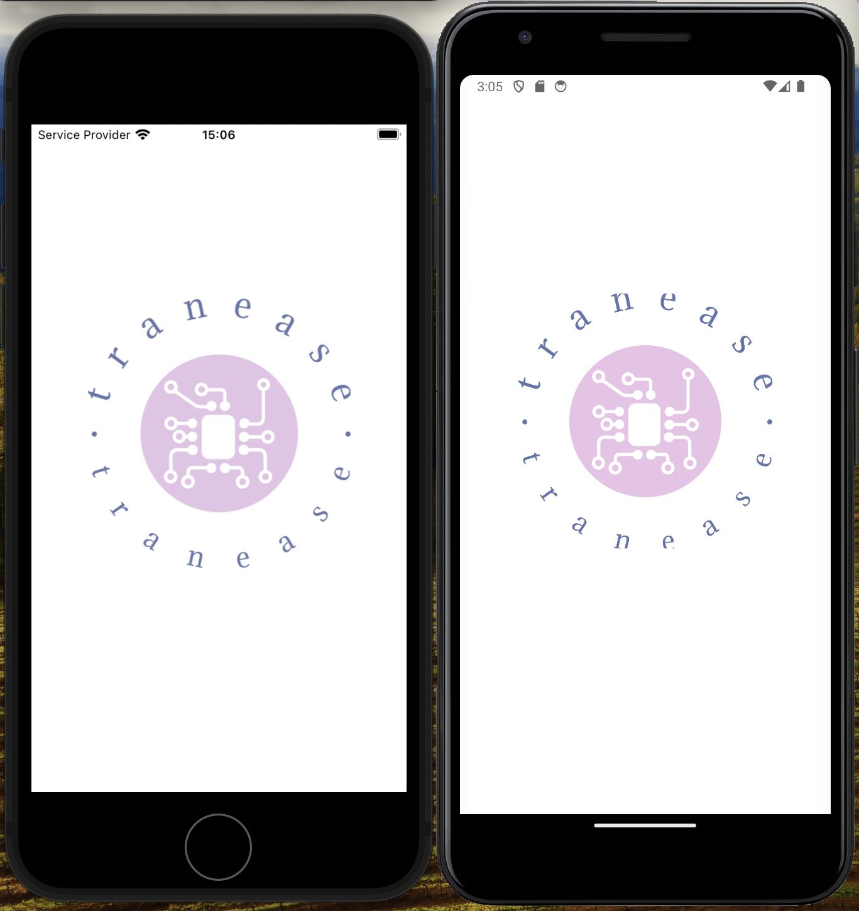

## Hospyta Mobile Dev Assessment(React Native)

Create a .env file and add
APP_API_BASE_URL=https://reqres.in

using 
    @reduxjs/toolkit react-redux- Application State Management
    npm install axios - To make requests to either their own or a third-party server to fetch data.
    npm install @react-native-async-storage/async-storage - Keeps persist the authentication state in local storage and retrieve it when the app loads.

Thus, AppWrapper: Load the token and user data when the app starts.

InitialRouteName: Set the initial route based on whether the token is present.

## Uploading/buliding the app
For andriod APK
    npm install -g eas-cli
    eas build -p android

Convert the file to APK
java -jar bundletool-all-1.16.0.jar build-apks --bundle=tranease.aab --output=tranease.apks --mode=universal

## Screenshot

npm install react-native-vector-icons
To include a calendar icon in your React Native component, you can use the Ionicons component from the react-native-vector-icons package. Here's your updated code with a calendar icon added: